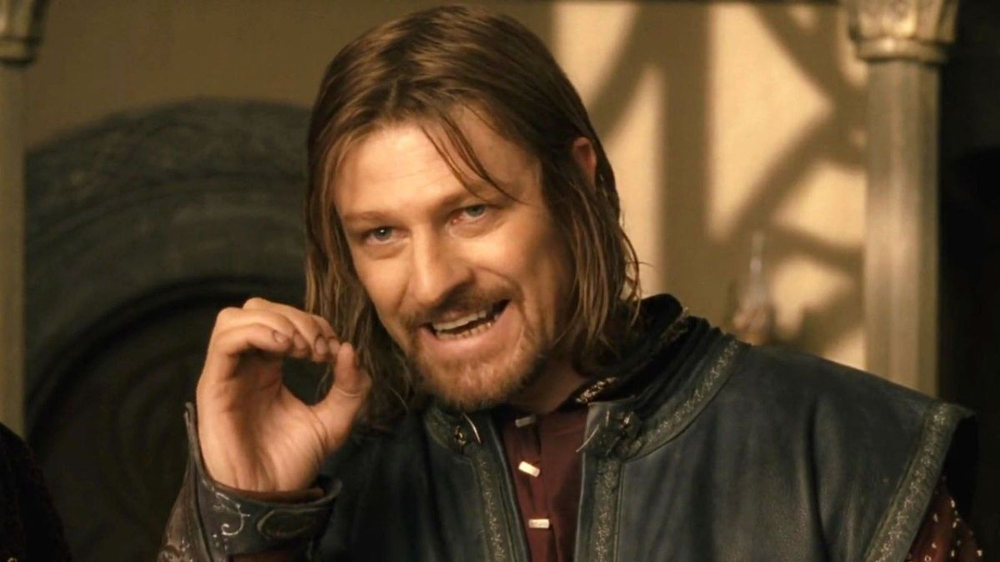
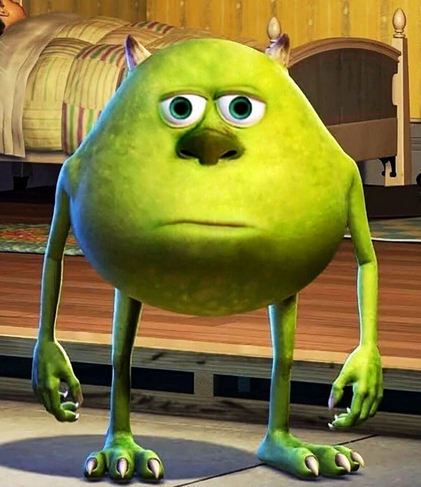
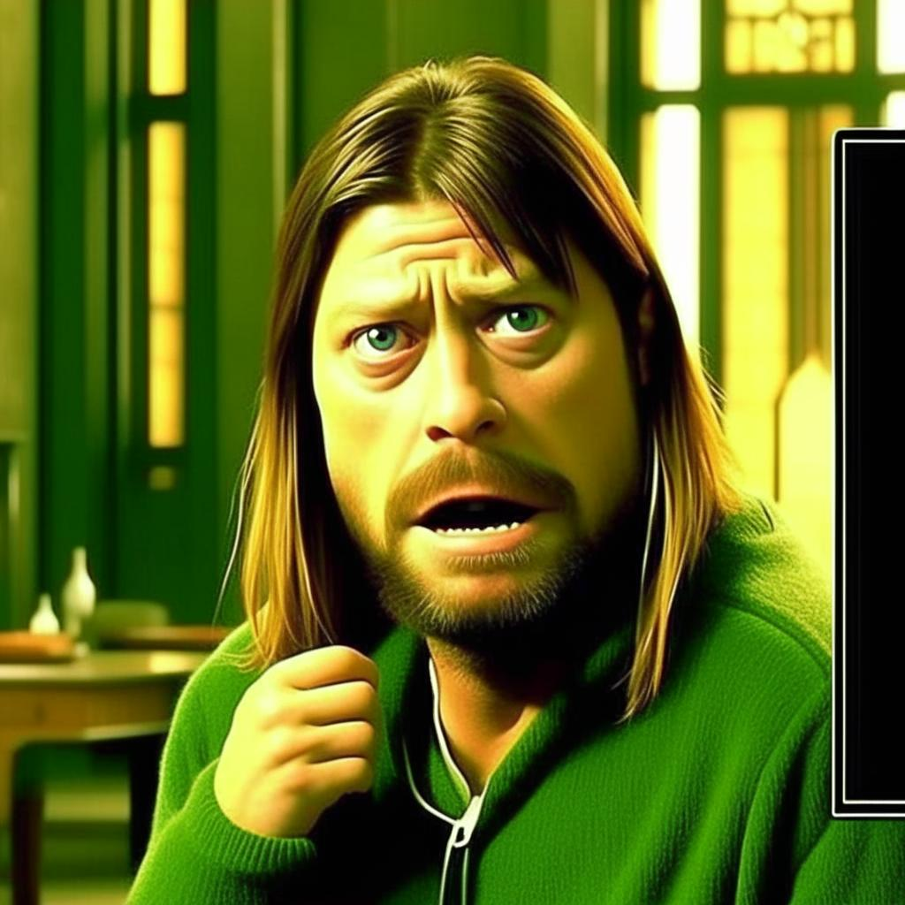

# nufa-test-task
Проверить решение можно с помощью скрипта
```
run.sh images/eyevazovski.jpeg images/got.jpeg
```
Результат будет сохранен в корне с именем result.jpg

Но лучше напрямую вызовом кода
```
python3 run.py --content_image_path images/got.jpeg --style_image_path images/eyevazovski.jpeg --result_image_path images/res_got_eyevazovski.jpeg
```

Тестовый кейс 1
```
python3 run.py --content_image_path images/got.jpeg --style_image_path images/eyevazovski.jpeg --result_image_path images/res_got_eyevazovski.jpeg
```

Контент


Стиль


Результат



Тестовый кейс 2
```
python3 run.py --content_image_path images/shrek.jpeg --style_image_path images/gigachad.jpeg --result_image_path images/res_shrek_gigachad.jpeg
```

Контент


Стиль


Результат

